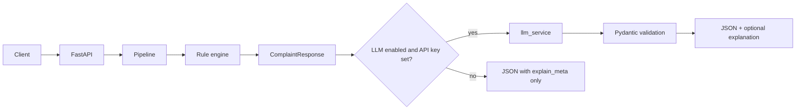

# Text Complaint Analysis API

AI-powered API that analyzes Arabic customer complaints using MARBERT-v2 models. It classifies sentiment, topic, and intent, then routes to an automated action via a rule engine.

## Architecture

### Request lifecycle (`POST /predict`)

```
Request → Middleware (request_id + timing) → /predict Route
                                                  ↓
                                            Pipeline:
                                              1. Arabic text cleaning
                                              2. Sentiment classification
                                              3. Topic classification
                                              4. Intent classification
                                              5. Rule engine → action
                                              6. Confidence guard
                                                  ↓
                                            JSON Response
```

### Optional LLM explanation layer (`POST /explain-classification`)

The rule engine and classifiers are **deterministic**. An OpenAI-compatible LLM may **only explain** the already computed labels and action; it does not change routing.



**Design decisions**

| Decision | Rationale |
|----------|-------------|
| Pipeline runs before any LLM call | Preserves deterministic boundaries; LLM sees fixed labels |
| `llm_service` + `services/llm_prompts.py` | Centralized prompts; routes stay thin |
| OpenAI-compatible HTTP API | Configurable `LLM_BASE_URL` for OpenAI or compatible hosts |
| `response_format: json_object` + Pydantic | Validates structured explanation; rejects malformed output |
| Fallback on failure | Classification always returned; `explanation` may be null |

**LLM failure modes** (`explain_meta`)

| `error_code` / `explain_source` | Meaning |
|---------------------------------|--------|
| `LLM_DISABLED` | `LLM_ENABLED=false` |
| `MISSING_API_KEY` | No `OPENAI_API_KEY` |
| `explain_source: disabled` | LLM not invoked |
| `LLM_TIMEOUT` | Request exceeded `LLM_TIMEOUT_SECONDS` |
| `LLM_HTTP_ERROR` | Non-2xx or network error from provider |
| `LLM_INVALID_RESPONSE` | Unparseable JSON or schema mismatch |
| `explain_source: llm` | Success; `explanation` populated |
| `explain_source: fallback` | LLM failed; see `error_code` |

### Project Structure

```
├── main.py                          # App entry point, lifespan, exception handlers
├── core/
│   └── pipeline.py                  # ML pipeline orchestration + rule engine
├── services/
│   ├── model_loader.py              # HuggingFace model loading
│   ├── sentiment_service.py         # Sentiment classification
│   ├── topic_service.py             # Topic classification
│   ├── action_service.py            # Intent classification
│   ├── llm_service.py               # OpenAI-compatible explanation (timeouts, validation)
│   └── llm_prompts.py               # Prompt templates for the explanation layer
├── interfaces/
│   ├── api/
│   │   ├── predict_route.py         # POST /predict endpoint
│   │   ├── explain_route.py         # POST /explain-classification
│   │   └── middlewares.py           # Request ID + timing middleware
│   └── schemas/
│       ├── complaint.py             # Pydantic request/response models
│       ├── explain.py               # Explain-classification schemas
│       └── enums.py                 # Label enums (Sentiment, Topic, Action)
├── configs/
│   ├── config.py                    # Environment-based settings
│   ├── exceptions.py                # Custom exception classes
│   └── logging.py                   # Structured JSON logging (structlog)
├── utils/
│   └── text_utils.py                # Arabic text normalization
├── tests/
│   ├── test_api.py                  # API endpoint tests
│   ├── test_explain_api.py          # Explain-classification route tests
│   ├── test_llm_service.py          # LLM client and failure-mode tests
│   └── test_pipeline.py             # Pipeline + rule engine tests
├── Dockerfile
├── docker-compose.yml
└── requirements.txt
```

## How It Works

### Models (MARBERT-v2)

| Model | Output | Labels |
|-------|--------|--------|
| Sentiment | Customer emotion | NEG, NEU, POS |
| Topic | Complaint category | FINANCIAL, TECHNICAL, POLICY_SECURITY, CONTENT |
| Intent | User action type | REPORT_BUG, USER_REQUEST, GENERAL_NOTE |

### Rule Engine

The action is determined by combining all three model outputs:

| Condition | Action |
|-----------|--------|
| Topic = POLICY_SECURITY | BLOCK_AND_REVIEW |
| Topic = FINANCIAL + Sentiment = NEG | FINANCIAL_ESCALATION |
| Topic = TECH + Intent = REPORT_BUG | CREATE_JIRA_TICKET |
| Topic = TECH + Sentiment = NEG | TECH_SUPPORT_ESCALATION |
| Topic = CONTENT + Intent = USER_REQUEST | CONTENT_MODIFICATION_QUEUE |
| Sentiment = POS | AUTO_REPLY_THANK_YOU |
| Sentiment = NEU + Intent = GENERAL_NOTE | ARCHIVE_NOTE |
| Default | GENERAL_SUPPORT_ROUTING |

### Confidence Guard

If any model's confidence drops below the threshold, the action is overridden to `MANUAL_REVIEW` to prevent wrong automated decisions.

## Setup

### Environment Variables

Copy the template and edit (never commit `.env`):

```bash
cp .env.example .env
```

Then set at least `HF_TOKEN` and, for `/explain-classification` LLM explanations, `OPENAI_API_KEY`:

```env
HF_TOKEN=hf_your_token_here
SENTIMENT_THRESHOLD=0.5
TOPIC_THRESHOLD=0.5
INTENT_THRESHOLD=0.5
ENABLE_CONFIDENCE_GUARDING=true
ENABLE_PREDICTION_LOGGING=true

# Optional: LLM explanation layer (POST /explain-classification)
LLM_ENABLED=true
OPENAI_API_KEY=
LLM_BASE_URL=https://api.openai.com/v1
LLM_MODEL=gpt-4.1
LLM_TIMEOUT_SECONDS=30
LLM_MAX_COMPLETION_TOKENS=512
```

### Run with Docker

```bash
docker-compose build
docker-compose up
```

The API will be available at `http://localhost:8000`.

### Run Locally

```bash
python -m venv .venv
source .venv/bin/activate    # Windows: .venv\Scripts\activate
pip install -r requirements.txt
uvicorn main:app --reload
```

## API Endpoints

### POST /explain-classification

Runs the same pipeline as `/predict`, then optionally calls the LLM to produce a **structured explanation** (`summary`, `rationale`, `limitations`). If the LLM is disabled, misconfigured, or fails, the response still includes the full `classification`; `explanation` may be `null` and `explain_meta` describes why.

```bash
curl -X POST http://localhost:8000/explain-classification \
  -H "Content-Type: application/json" \
  -d '{"text": "التطبيق يعلق عند الدفع"}'
```

### POST /predict

```bash
curl -X POST http://localhost:8000/predict \
  -H "Content-Type: application/json" \
  -d '{"text": "حولت مبلغ ومارجع لي وخدمة العملاء ما ردوا علي"}'
```

Response:
```json
{
  "sentiment": {
    "label": "NEG",
    "confidence": 0.58,
    "explanation": "Sentiment: LABEL_0 -> NEG",
    "low_confidence": true
  },
  "topic": {
    "label": "FINANCIAL",
    "confidence": 1.0,
    "explanation": "Topic: LABEL_1 -> FINANCIAL",
    "low_confidence": false
  },
  "intent": {
    "label": "USER_REQUEST",
    "confidence": 1.0,
    "explanation": "Action: LABEL_1 -> USER_REQUEST",
    "low_confidence": false
  },
  "action": {
    "label": "FINANCIAL_ESCALATION",
    "decision_source": "RULE_ENGINE"
  },
  "meta": {
    "model_version": "MARBERT-v2"
  }
}
```

### GET /health

Returns `{"status": "ok"}` when the service is running.

## Observability

### Structured Logging

All logs are JSON-formatted via structlog. Every request gets a unique `request_id` that appears in all related logs:

```json
{"event": "pipeline_started", "request_id": "c72dc0a5-...", "path": "/predict", "method": "POST"}
{"event": "sentiment_predicted", "label": "NEG", "confidence": 0.58, "request_id": "c72dc0a5-..."}
{"event": "Request completed", "status_code": 200, "duration_ms": 234.41, "request_id": "c72dc0a5-..."}
```

### Error Handling

| Exception | Status Code | When |
|-----------|-------------|------|
| ModelLoadError | 503 | Model fails to load from HuggingFace |
| ConfigurationError | 400 | Missing env vars (e.g., HF_TOKEN) |
| PredictionError | 500 | Model inference fails |
| ValidationError | 422 | Invalid input (empty text, missing field) |

LLM failures on `/explain-classification` do not return HTTP errors by default: check `explain_meta` and optional `explanation`.

## Tests

```bash
pytest tests/ -v
```

## Tech Stack

| Component | Technology |
|-----------|------------|
| Framework | FastAPI |
| NLP | HuggingFace Transformers (MARBERT-v2) |
| Optional LLM | OpenAI-compatible API via httpx (async, timeouts) |
| Validation | Pydantic v2 |
| Logging | structlog (JSON) |
| Container | Docker + docker-compose |
| Server | Uvicorn |
